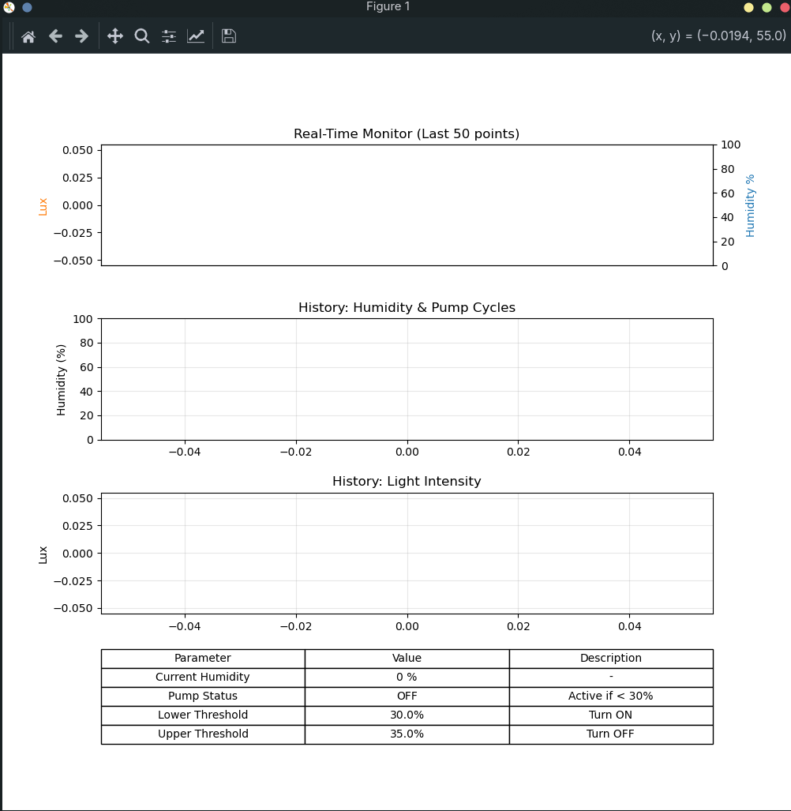
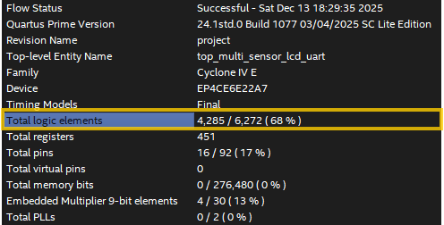
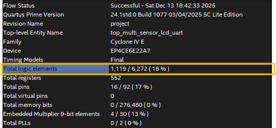
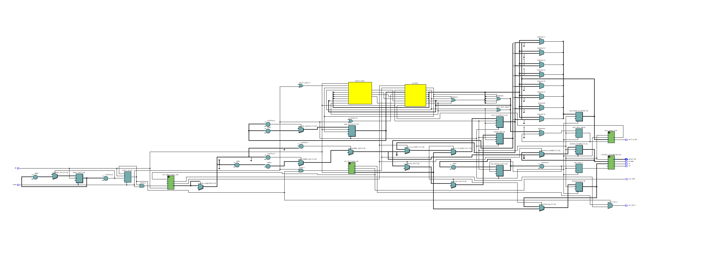
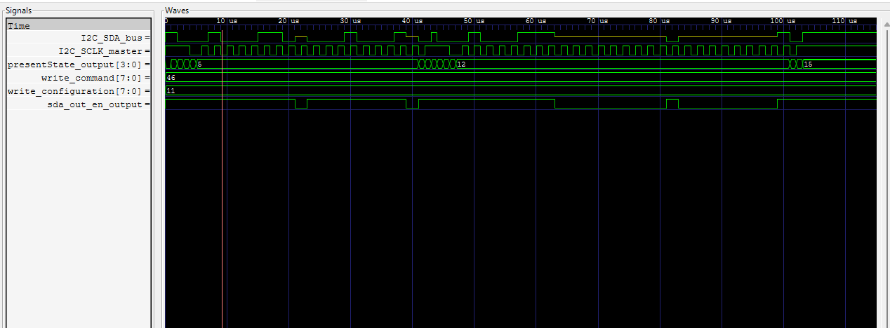
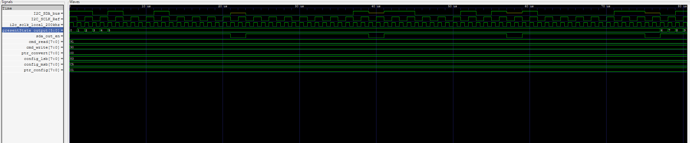
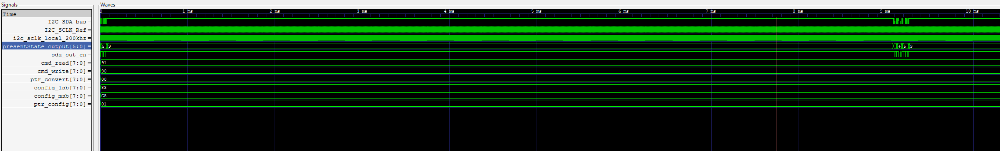
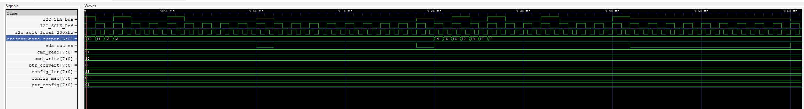
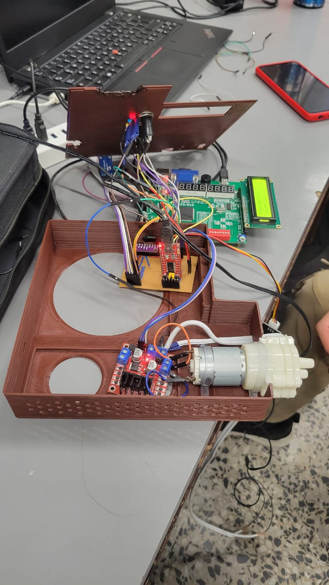

# Proyecto final - Electrónica Digital 1 - 2025-II

# Integrantes

    - Andres Felipe Castro Lopez (Afcastrol)
    - Diego Andres Barragan Martinez (chopsueyb)
    - Santiago Quevedo López (Volta50)

# Nombre del proyecto
Sistema de Riego Automatizado con FPGA

# Documentación

## Descripción de la arquitectura
El sistema implementa un control de lazo cerrado para mantener la humedad de una planta, monitoreando variables ambientales (Luz y Humedad) a través de sensores I2C y actuando mediante un sistema de bombeo controlado por PWM.

## Sensores
Se utilizaron 2 sensores principales gestionados por controladores I2C independientes en la FPGA.

### Sensor de intensidad lumínica BH1750 (Módulo GY-30)
Se seleccionó este sensor digital por su interfaz I2C y alta resolución. El controlador diseñado implementa una Máquina de Estados Finitos (FSM) que gestiona el protocolo de comunicación:

1.  **Wake Up**: Se envía la dirección del dispositivo (`0x23` o similar) + bit de escritura (`0`) seguido del comando `0x01` (Power On).
2.  **Configuración**: Se configura el modo de medida. Se eligió **High Resolution Mode** ya que no contamos con requerimientos excepcionales de latencia y se prioriza la precisión.
3.  **Espera**: La FSM entra en un estado de espera de ~180 ms para permitir que el sensor complete la integración de luz.
4.  **Lectura**: Se envía la dirección + bit de lectura (`1`).
    *   El sensor envía 2 bytes: primero el MSB (8 bits más significativos), luego el LSB.
    *   El maestro (FPGA) responde con ACK tras el primer byte y NACK tras el segundo para finalizar la transacción.
5.  **Cálculo**: El valor RAW obtenido se procesa internamente: `Lux = ((MSB << 8) | LSB) / 1.2`.

### Sensor capacitivo de humedad (con ADC ADS1115)
Para leer la señal analógica del sensor capacitivo (rango 1.2V - 3.0V aprox), se utiliza un ADC ADS1115 de 16 bits.

*   **ADC (Analog to Digital Converter)**: Toma el voltaje del sensor y entrega dos bytes (enteros con signo de 16 bits). El valor máximo teórico es $2^{15}-1$.
*   **Modo de Operación**: 4.096V (Gain 1).
    *   *Nota*: En el modo 2.048V se perdía rango de voltaje (información del sensor) si este superaba los 2V. Por tanto, se sacrificó resolución utilizando el rango de ±4.096V para cubrir toda la excursión de la señal.

**Etapas de configuración de la FSM (Modo Single Shot):**
1.  **Configuración de Escritura**:
    *   START -> Address + Write -> ACK.
    *   Selección del registro de Configuración (`0x01`).
    *   Escritura de 2 bytes de configuración (MSB y LSB) para iniciar una conversión *Single Shot*.
    *   *Justificación*: Se optó por *single shot* en lugar de continuo para garantizar que cada lectura que toma la FPGA sea un dato "fresco" disparado bajo demanda, evitando leer datos viejos durante el periodo de conversión.
2.  **Espera**: Tiempo de conversión dependiente del *Data Rate* (aprox. 860 SPS o configurado según necesidad).
3.  **Apuntador de Lectura**:
    *   START -> Address + Write -> ACK.
    *   Selección del registro de Conversión (`0x00`).
4.  **Lectura de Datos**:
    *   START -> Address + Read -> ACK.
    *   Recepción de 2 bytes (MSB, LSB). El maestro envía NACK al final.
5.  **Repetición**: Este ciclo se repite cada vez que se requiere actualizar el dato.

## Visualización
**Pantalla LCD 16x2 (Modo Paralelo 4 u 8 bits)**

*   **FSM del Controlador**: Se diseñó una máquina de estados que inicializa la pantalla (secuencia de comandos estándar HD44780) y luego escribe caracteres estáticos ("Humedad:", "Luz:").
*   **Texto Dinámico**: Se diseñó un estado adicional perpetuo que actualiza cíclicamente las posiciones de memoria correspondientes a los valores numéricos.
*   **Conversión**: Los valores de 16 bits de los sensores pasan por un convertidor **BCD (Binary-Coded Decimal)** secuencial (algoritmo Double Dabble) para transformar el valor binario a caracteres ASCII y ser representados en la pantalla.

## MotoBomba
*   **Actuador**: Bomba de agua de diafragma o sumergible.
*   **Requerimiento**: 12 V DC.
*   **Driver**: Se utilizó un **Puente H (L298N o similar)** para manejar la potencia.
*   **Control**: `motor_driver.v` genera una señal **PWM** (Pulse Width Modulation) desde la FPGA hacia el pin `Enable` del puente H, permitiendo controlar la velocidad de bombeo y dosificar el riego con precisión, evitando el golpe de ariete o sobre-riego.

## UART
Para la obtención y registro de los datos con el fin de analizar la histéresis del suelo y recabar data para investigación, se implementó un protocolo UART (Tx).

*   **Hardware**: Convertidor Serial FT232 (USB-TTL).
*   **Protocolo**: Solo transmisión (Tx) desde la FPGA hacia el PC.
*   **Trama de Datos**: Se utilizaron cabeceras para diferenciar la fuente de los datos:
    *   `AAXX`: Datos del ADS1115 (Humedad). `AA` es el identificador, `XX` es el byte de datos.
    *   `BBXX`: Datos del GY-30 (Luz).
    *   Se envían 4 bytes por paquete o nibbles codificados (según implementación detallada en código).
*   **Procesamiento**: Usando la librería `pyserial` de Python, se capturan y procesan los datos en el PC, generando gráficas en tiempo real que facilitan el monitoreo. La información se exporta a **CSV** para análisis posterior.

## Energía Renovable
El sistema es autónomo energéticamente:
*   **Fuente**: Panel Solar.
*   **Almacenamiento**: Batería de 12.7 V (Plomo-Ácido o Litio).
*   **Gestión**: Un controlador de carga regula la energía del panel a la batería. La alimentación de la bomba (12V) se toma directamente del sistema de batería/controlador.

## Pruebas
1.  **Calibración del GY-30**: Comparación de lecturas con luxómetros de referencia (o apps calibradas) usando fuentes de luz controladas (linternas, lámparas).
2.  **Calibración de Humedad**: Se establecieron los rangos porcentuales.
    *   0% = Sensor al aire (seco).
    *   100% = Sensor sumergido en agua.
    *   **Punto de Riego**: Se calibró experimentalmente que un rango de **20-30%** corresponde a tierra seca que necesita riego.
3.  **Dosificación**: Medición volumétrica del agua bombeada por segundo para ajustar el temporizador de la FPGA y evitar encharcamientos.
4.  **Prueba de Recolección de Datos**: Operación continua durante 24 horas con el sistema de riego activado para validar la estabilidad y capturar el ciclo de secado/riego.

## ¿Qué se puede hacer con los datos recolectados?
(Sugerencias de aplicación con IA/Data Science)

Con los datos históricos almacenados en los CSV, se abren posibilidades avanzadas de análisis:
1.  **Predicción de Humedad (Machine Learning)**: Entrenar un modelo de regresión (ej. Random Forest o Redes Neuronales LSTM) que tome la hora del día y la intensidad lumínica acumulada para **predecir** cuándo la humedad caerá por debajo del umbral crítico. Esto permite riego preventivo.
2.  **Optimización Hídrica**: Analizar las curvas de histéresis del suelo para determinar el **mínimo volumen de agua** necesario para recuperar la humedad ideal, reduciendo el desperdicio.
3.  **Detección de Anomalías**: Un algoritmo de *Anomaly Detection* puede monitorear la curva de descenson de humedad. Si la humedad baja mucho más rápido de lo usual (fuga en maceta) o no sube tras activar la bomba (falla de bomba o falta de agua), el sistema puede alertar al usuario.

---
## Interfaz de monitoreo en tiempo real

Se desarrolló una interfaz gráfica en Python (`neue(1).py`) utilizando la librería `matplotlib` para la visualización y registro de datos en tiempo real. Esta herramienta permite:

1.  **Visualización Dual en Tiempo Real**: Gráfica superior con doble eje Y para correlacionar instantáneamente los valores de **Luz (Lux)** y **Humedad (%)**.
2.  **Registro Histórico**: Gráficas de tendencias a largo plazo para ambas variables, facilitando el análisis del comportamiento de la planta durante ciclos completos de día/noche.
3.  **Indicador de Actuación**: La gráfica de humedad sombrea automáticamente el fondo en **color verde** cuando la bomba está activa (regando), permitiendo verificar visualmente la respuesta del sistema ante el umbral de resequedad (< 30%).
4.  **Panel de Estado**: Una tabla inferior muestra los valores numéricos actuales, el estado de la bomba (ON/OFF) y los umbrales de histéresis configurados.
5.  **Data Logging**: El script captura las tramas UART (`AA` para Lux, `BB` para Humedad) y las almacena automáticamente en un archivo `sensor_pump_data.csv` con marca de tiempo, para su posterior análisis con algoritmos de IA.

## Optimización de Hardware
Uno de los retos principales fue la gestión de recursos de la FPGA.

### Comparativa de Consumo de Elementos Lógicos (LEs)
Se realizó una optimización crítica en el módulo de control del LCD, sustituyendo la conversión binaria a decimal basada en división combinacional por el algoritmo secuencial **Double Dabble**.

| Método de Conversión | Descripción | Consumo Estimado de LEs | Impacto |
| :--- | :--- | :--- | :--- |
| **División Combinacional** | Uso de operadores `/` y `%` en paralelo para separar 5 dígitos. | **4285 LEs** | Saturación de la FPGA, tiempos de síntesis altos. |
| **Double Dabble (Secuencial)** | Algoritmo de desplazamiento y suma (Shift-Add-3). | **1119 LEs** | **Reducción del ~74%**, síntesis rápida y eficiente. |

Esta optimización permitió liberar recursos para implementar mejoras futuras o módulos adicionales sin comprometer el área del dispositivo.

## Diagramas de la arquitectura(RTL Viewer)

## Simulaciones

### GY 30

### ADS1115
Configuración de escritura

Esperar tiempo de conversión (9 ms)

Lectura de datos

## Evidencias de implementación
[VideoFuncionamiento](https://www.dropbox.com/scl/fi/mmzdw5xjd3rb5vh9lgk6m/PruebaFuncionamiento.mp4?rlkey=hg5b1ll42qiojtzcmdeh52oiy&st=78oq6y1m&dl=0)

